# Generative

Command-line generative art in Golang.
See command help for options.

```
go run main.go [command] [flags]
```

### Commands

#### anderson

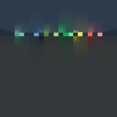

#### crack

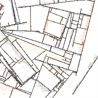

#### crawl

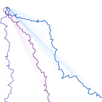

#### firework

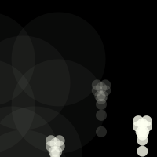

#### grid

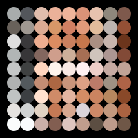

#### growth

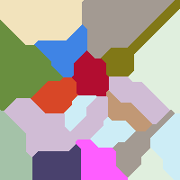

#### layer

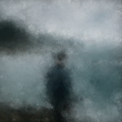

#### rows

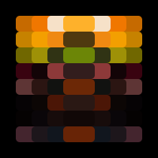

#### spiral

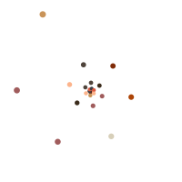

#### stack

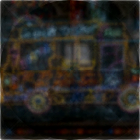

#### sun

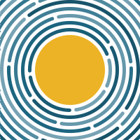